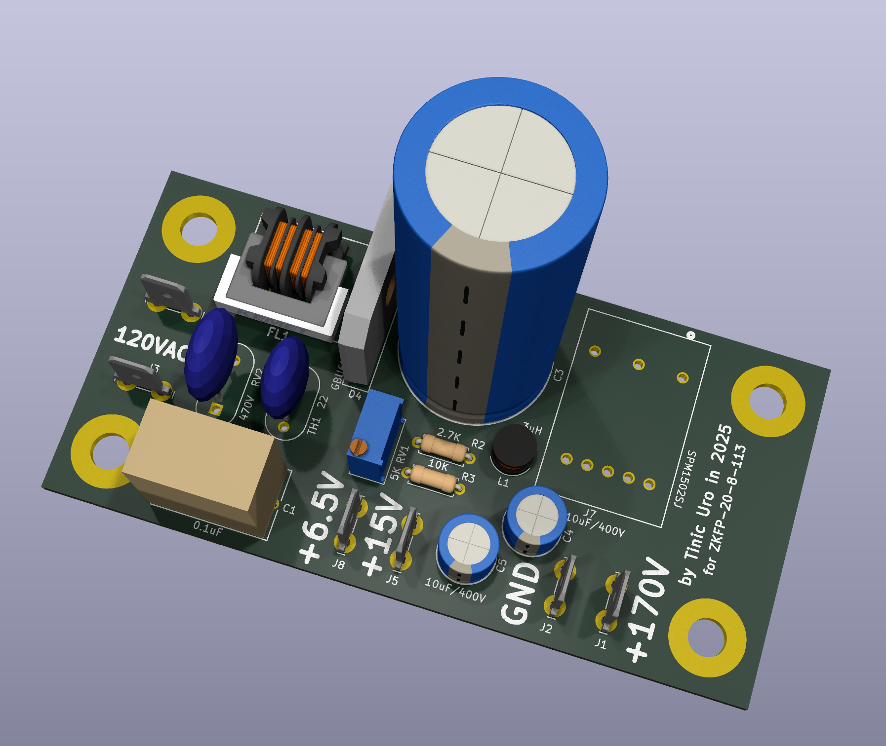
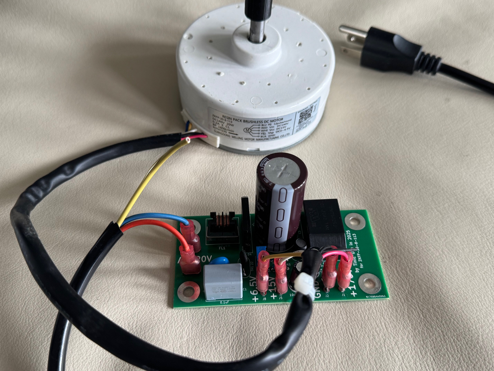
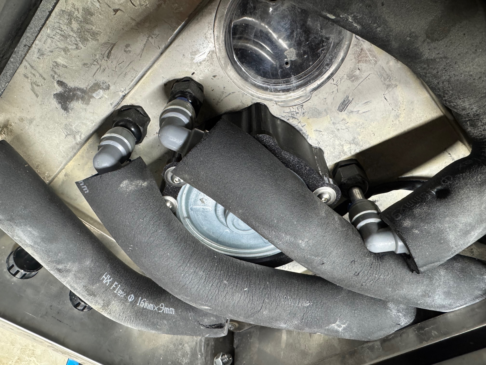
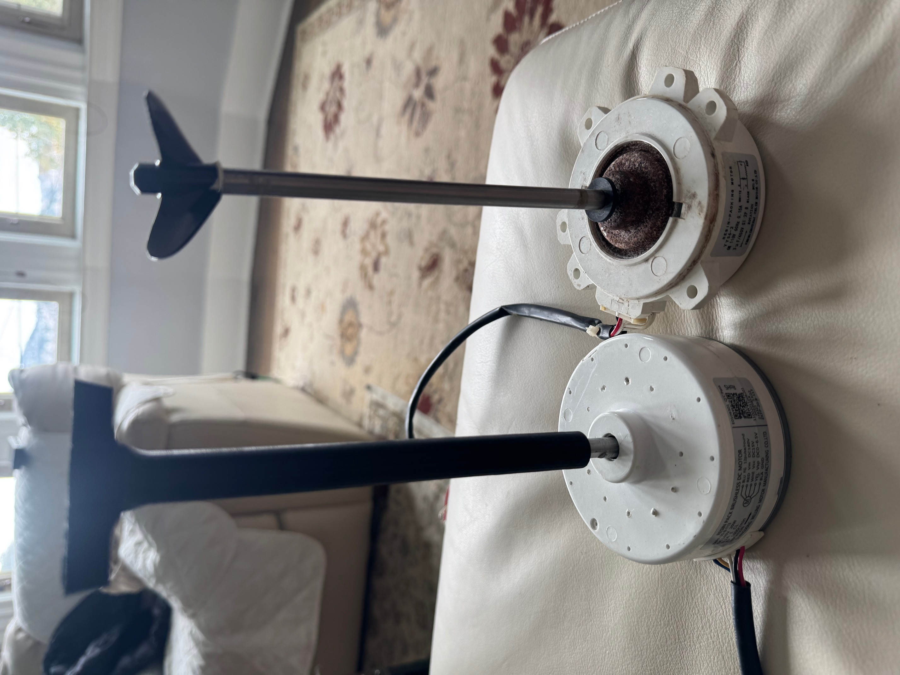
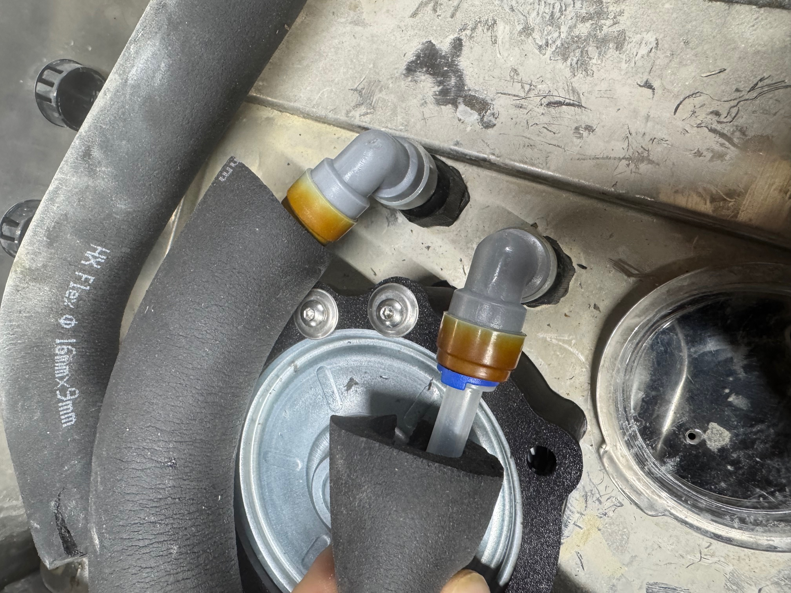
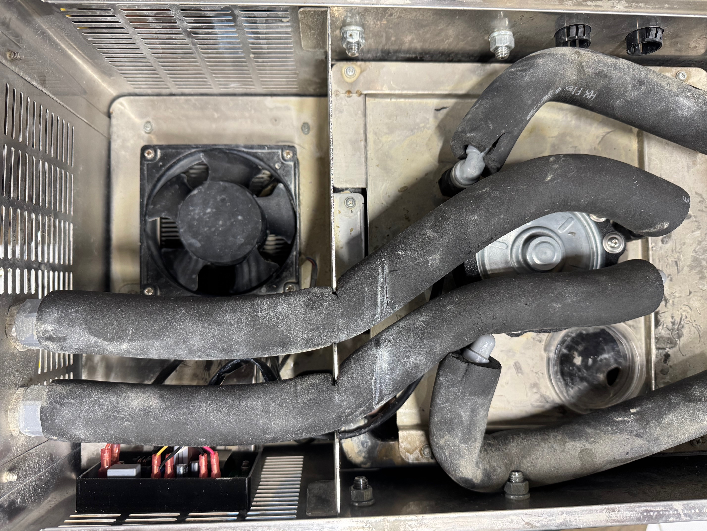

# blcd-driver
Motor driver for brushless air conditioner motors

This is a PCB design for typical adjustable brushless motors used in air conditioning units. These units are great since they are sealed and have ajustable speed while using very little power. I used them to drive a stirrer motor to replace the misspecced AC motors (model YYS6-2/110V/60Hz/0.15A) on the otherwise amazing KOMOS KRYO Inline Draft Beer Chillers which tend to fail quickly and generate extreme amounts of heat. Power consumption is reduced from ~17W to around ~4W for my application while staying _completely_ cool.

The following units have been tested:

140VDC rated (on 120VAC power):
- ZKFP-20-8-113

310VDC rated (on 240VAC power):
- WZDK30-38G

Notes:
- While these units are rated 140/310VDC they work fine with regular rectified AC power (170/338VDC) which makes the implementation simple/cheap.
- The parts used here are complete overkill as this is not designed for mass manufacturing and the price difference which cheaper parts was negligible in single digit units (~$20 with the DigiKey BOM).
- The only special part here is the 15V DC/DC converter as using a couple of LDOs for this application would have caused excessive power use and heat. A constant current source like a capacitive dropper would not have worked either as the power consumption by these motors on the 15V rail is not constant.
- The PCB was designed to stay under 100x100mm to take advantage of flat price of $5 PCBWay offers for this size.

New motor installed in the beer chiller:

New stirrer motor with 3d printed blade on the left, old on the right:

The push in fitting were completely coooked by the old motor:

Full assembly of the new motor in the chiller, the PCB is othe bottom right:

